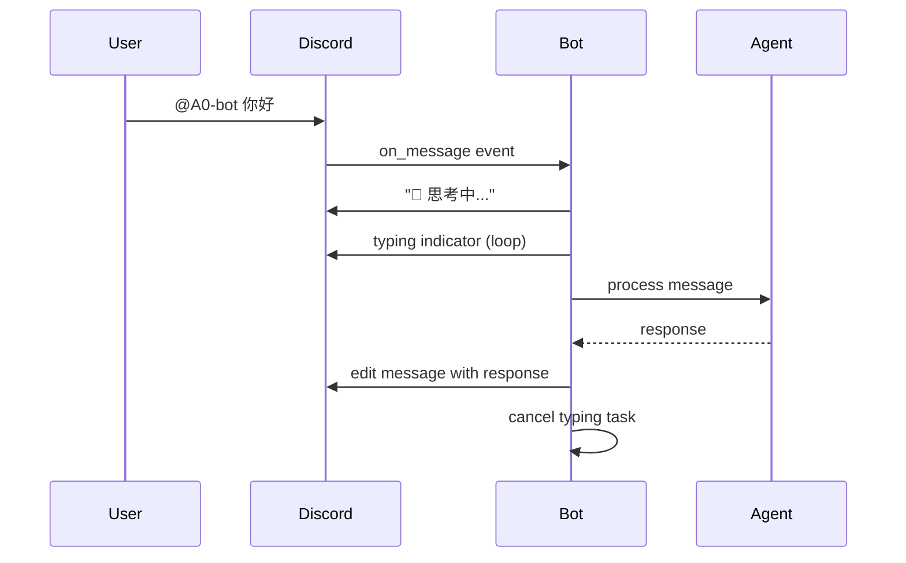

# Discord Typing Indicator Enhancement Walkthrough

本文档记录了为 Discord 适配器添加 typing indicator 和即时反馈功能的实现过程。

## 变更概述

**目标**：解决用户发送消息后长时间无反馈的问题，与 Telegram 适配器保持一致的用户体验。

**实现功能**：
1. 即时发送 "🤔 思考中..." 占位消息
2. 持续显示 "Bot is typing..." 指示器
3. 处理完成后更新占位消息为实际回复

## 代码变更

### [discord_adapter.py](file:///h:/AI/agent-zero/python/channels/discord_adapter.py)

render_diffs(file:///h:/AI/agent-zero/python/channels/discord_adapter.py)

### 新增方法说明

| 方法 | 功能 |
|------|------|
| `_keep_typing()` | 每 8 秒刷新一次 typing 状态，直到被取消 |
| `_handle_with_typing()` | 统一的消息处理流程，包含占位消息和 typing |
| `_send_attachments()` | 独立的附件发送方法，支持本地文件和 URL |

### 核心流程



## 验证步骤

### 1. 重启 Docker 容器

```bash
cd h:\AI\agent-zero
docker-compose down && docker-compose up -d
```

### 2. 检查日志确认启动

```bash
docker-compose logs | findstr /i "discord"
```

预期输出：
```
Discord: Logged in as A0-bot#0073
```

### 3. Discord 中测试

1. 发送简单消息：`@A0-bot 你好`
   - ✅ 立即看到 "🤔 思考中..."
   - ✅ 看到 "Bot is typing..."
   - ✅ 消息更新为回复

2. 发送长回复问题：`@A0-bot 帮我查一下今天的天气`
   - ✅ typing 持续显示直到回复完成

## 注意事项

- Discord 消息长度限制 2000 字符，超长回复会自动分割
- typing 状态每 8 秒刷新，避免频繁 API 调用
- 所有异常都会更新占位消息显示错误状态
